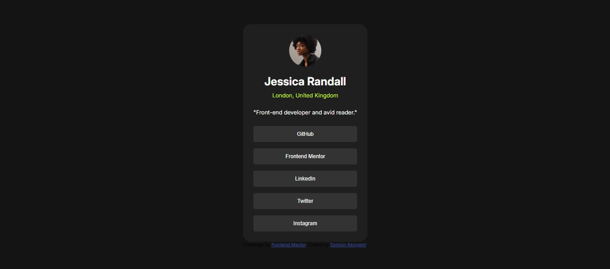

# Frontend Mentor - Social links profile solution

This is a solution to the [Social links profile challenge on Frontend Mentor](https://www.frontendmentor.io/challenges/social-links-profile-UG32l9m6dQ). Frontend Mentor challenges help you improve your coding skills by building realistic projects.

## Table of contents

- [Overview](#overview)
  - [The challenge](#the-challenge)
  - [Screenshot](#screenshot)
  - [Links](#links)
- [My process](#my-process)
  - [Built with](#built-with)
  - [What I learned](#what-i-learned)
  - [Continued development](#continued-development)
- [Author](#author)

## Overview

### The challenge

Users should be able to:

- See hover and focus states for all interactive elements on the page

### Screenshot

### Links

- Solution URL: [Add solution URL here](https://github.com/donttouchtomi/Social-Profile.git)
- Live Site URL: [Add live site URL here](https://snazzy-paletas-129bed.netlify.app/)

## My process

### Built with

- Semantic HTML5 markup
- CSS custom properties
- Flexbox

### What I learned

I learnt how to use the flex-direction property well.
I also how to write semantic HTML while doing this project

### Continued development

For now i feel i have gain much knowledge in CSS so, so far the projects i have done are light work, What i need to work on now is my Knowledge on Javascript

## Author

- Frontend Mentor - [@donttouchtomi](https://www.frontendmentor.io/profile/donttouchtomi)
- Twitter - [@donttouch_tomi](https://www.twitter.com/donttouch_tomi)
